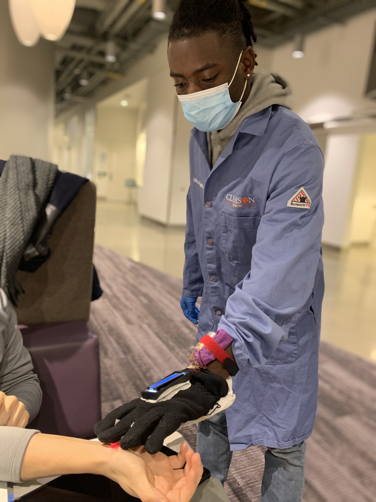

# Smart Glove Detector

This is an implementation of a Smart Glove that can detect internal temperature and oxygen saturation of a patient, as well as giving small diagnoses based on those values.

## Description

We developed an embedded system as a glove capable of detecting internal temperature and oxygen saturation of a patient, and displaying those values. The glove is able to work without any laptop, but comes with a graphical user interface as an additional tool. Thanks to the GUI, the glove is able to send via a serial communication more data than how much is able to display on the LCD screen positioned on the top of the glove.

    

## Getting Source Code

The source code is available under the folders `*_source_code`, depending on which programming language it is.

The GUI written in python should be re-written by scratch. We focused on developing a good JavaFX GUI.

A detailed explanation on our reasoning can be found [here](project_report/Wearable-Final-Paper.pdf).

Clone the repository and use each `*_source_code` folder as the root for each project.

### Arduino

We harnessed Arduino to implement an application in C++ in order to read temperature and oxygen from the sensors and display them on the LCD screen. The code has been carefully thought to ease extension and maintainability.

### JavaFX

We used JavaFX for developing an interactive graphical interface with the doctor. As for Arduino, the code has been carefully thought to ease extension and maintainability.

### Python

The GUI written in Python should be re-written from scratch. It's been an initial experiment to see the differences with JavaFX during coding.

## Support

For any question regarding the project, send me an email at [giacomini.davide@outlook.com](mailto://giacomini.davide@outlook.com)

## Contributing

Any contribution is welcome. The more clean and commented is the code, the better it is. In this way, we ease the development for future works and save a great amount of time in maintenance.

## Developers

- Davide Giacomini ([GitHub](https://github.com/davide-giacomini), [Linkedin](https://www.linkedin.com/in/davide-giacomini/), [email](mailto://giacomini.davide@outlook.com))
- Jake Campbell ([GitHub](https://github.com/Jacob-Campbell))
- Sem Belay
- Alejandro Dorvall

## Further Implementation

This project is open to further implementation with other sensors or other applications.