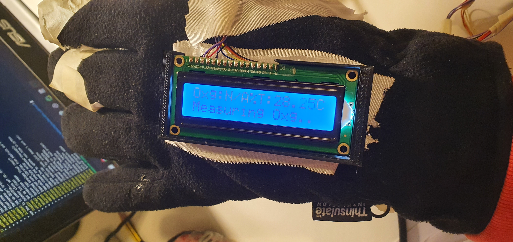

# Smart Glove Detector Arduino Source Code

The Arduino source code encapsulates the embedded functionalities of the glove and builds a firmware to be uploaded into the ATmega328 microcontroller.

## Design

The code harnesses the objective oriented programming of C++. Each sensor is represented by a different class, and each of them gets setup and run separately by the main.

The code is small, but it is thought for further implementations.

## Hardware Assembly

### Requirements

For the assembly of the hardware, those sensors and boards are needed:

- [Lipo Battery](https://www.amazon.com/EEMB-1100mAh-Battery-Rechargeable-Connector/dp/B08FD39Y5R/ref=sr_1_3?keywords=battery%2Blithium%2Barduino&qid=1639353720&sr=8-3&th=1)
- [Arduino Pro or Pro Mini ATmega328 (3.3V, 8 MHz)](https://www.sparkfun.com/products/11114)
- [LCD Screen 16x2](https://www.amazon.com/HiLetgo-Display-Backlight-Controller-Character/dp/B00HJ6AFW6/ref=sr_1_3?keywords=lcd+screen+16x2&qid=1639352794&sr=8-3)
- [Pulse Oximeter and Heart Rate Sensor](https://www.sparkfun.com/products/15219)
- [IR Thermometer Evaluation Board - MLX90614](https://www.sparkfun.com/products/10740)
- [FireBeetle Board-328P with BLE4.1](https://www.dfrobot.com/product-1646.html)
- Wires
- Soldering tools
- USB type B cable

We connected the three sensors (oximeter, thermometer and LCD) to the FireBeetle board:

<p align="center">

</p>

Both the Oximeter and the Thermometer work with the I2C protocol. They come by default with different physical addresses, but if does not happen, the addresses must be manually changed. The I2C supports several sensors, but they must have different physical addresses. Each class in the source code has its own address.

### Pin connections

<p align="left">

</p>

| Fire Beetle | Oximeter |
| ----------- | ----------- |
| 3V3 | 3v3 |
| GND | GND |
| SDA | SDA |
| SCL | SCL |
| D8 | RST |
| D9 | MFIO |

<p align="left">

</p>

| Fire Beetle | Thermometer |
| ----------- | ----------- |
| 3V3 | 3v3 |
| GND | GND |
| SDA | SDA |
| SCL | SCL |

<p align="left">

</p>

| Fire Beetle | LCD |
| ----------- | ----------- |
| 5V | Vdd |
| GND | Vss |
| D6 | Vo |
| D12 | RS |
| GND | RW |
| D11 | E |
| D5 | D4 |
| D4 | D5 |
| D3 | D6 |
| D2 | D7 |
| 5V | A |
| GND | K |

### Final Result

Our glove is able to display the oxygen saturation of the patient as well as its internal temperature. It displays a small diagnosis on the LCD screen depending on the values of the oxygen and the temperature.

<p align="center">
    
</p>

- Objective of the arduino source code
- Board version
- Libraries used

## Software Development

### Requirements

We used C++ of this version
```
c++ (Ubuntu 9.3.0-17ubuntu1~20.04) 9.3.0
```

We developed the code with the help of the [PlatformIO](https://platformio.org/) framework and [VSCode](https://code.visualstudio.com/).

We used these libraries for the sensors and for Arduino:
- Arduino.h
- Wire.h
- [SparkFun Bio Sensor Hub Library by Elias Santistevan](https://www.arduino.cc/reference/en/libraries/sparkfun-bio-sensor-hub-library/) for the oximeter
- [LiquidCrystal by Arduino](https://www.arduino.cc/en/Reference/LiquidCrystal) for the LCD
- [SparkFun Qwiic IR Thermometer MLX90614 Arduino Library by SparkFun Electronics](https://www.arduino.cc/reference/en/libraries/sparkfun-qwiic-ir-thermometer-mlx90614-arduino-library/) for the thermometer

## Repository Setup

To get the source code:

Clone the repository

```
git clone https://github.com/davide-giacomini/Smart_Glove_Covid-19_Detector.git
cd Smart_Glove_Covid-19_Detector/arduino_source_code
```

For those of you who want to use the PlatformIO IDE within VSCode, [install](https://marketplace.visualstudio.com/items?itemName=platformio.platformio-ide) the extension and navigate to `Pio Home -> Open -> Import Arduino Project` and then select the board `Arduino Pro or Pro Mini ATmega328 (3.3V, 8 MHz)`. Check the box `libraries installed by Arduino IDE` if you have already installed Arduino on your laptop.

Then, install the last three libraries that I mentioned in the bullet points before (SparkFun Bio Sensor Hub Library, LiquidCrystal, SparkFun Qwiic IR Thermometer MLX90614 Arduino Library) going into `libraries -> search library -> click on it -> add to project` and then choose your project.

Afterwards, be sure that in `platform.ini` there is this script:
```
[env:pro8MHzatmega328]
platform = atmelavr
board = pro8MHzatmega328
framework = arduino
upload_port = /dev/ttyACM0  ; this port changes depending on your system
lib_deps = 
	arduino-libraries/LiquidCrystal@^1.0.7
	sparkfun/SparkFun Bio Sensor Hub Library@^1.0.5
	sparkfun/SparkFun Qwiic IR Thermometer MLX90614 Arduino Library@^1.1.3
```

## Developers

- Davide Giacomini ([GitHub](https://github.com/davide-giacomini), [Linkedin](https://www.linkedin.com/in/davide-giacomini/))
- Jake Campbell ([GitHub](https://github.com/Jacob-Campbell))

## Further Implementations

A test suite has to be yet implemented.

Moreover, if additional sensors get built on the glove, or additional values must be read, the source code is open to be extended.