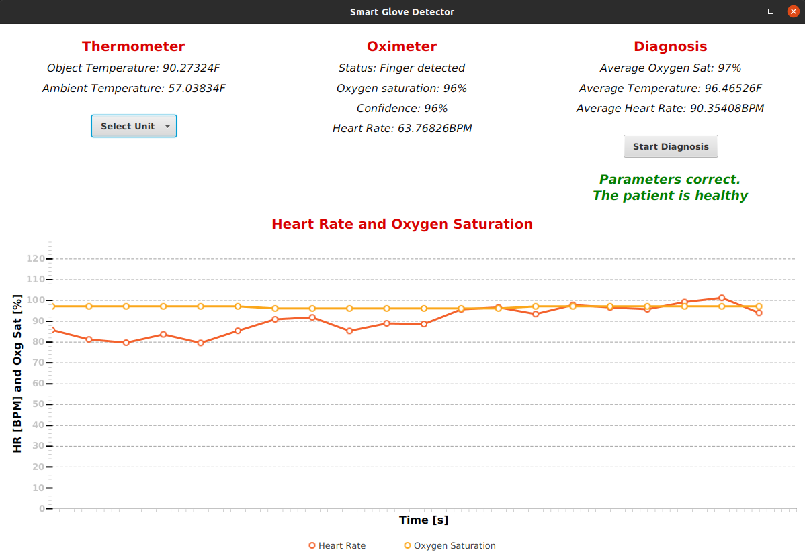

# Smart Glove Detector Java Source Code

This is a sample application in JavaFX displaying the values taken by the thermometer and the oximeter on the glove.

## Description

This application is able to read at real-time the values taken by the glove, and it displays them with some labels and a chart. It is a very simple application that doesn't do much, but it has been coded for being easily extended and maintained.



## Design
This application harness the pattern [MVC](https://it.wikipedia.org/wiki/Model-view-controller) for managing the interactions with the user. I used the [Java Properties](https://docs.oracle.com/javase/7/docs/api/java/util/Properties.html) for dynamically binding the View to the Model, and manually implemented an interface Observer-Observable to notify the Controller from the View.

I used CSS for styling the GUI and I also prepared a [Bundle](https://docs.oracle.com/javase/8/docs/api/java/util/ResourceBundle.html) template under the folder `resources` for easily changing language. I did not yet implemented different languages though.

I did not have the glove when I coded it, hence I created a method that is useful to *simulate* reading from the serial monitor. In fact Java supports the serial communication through Arduino.

I also implemented a first sketch of how the application should be tested if it increases, in order to easily do regression tests and unit tests. I used [JUnit](https://junit.org/junit5/docs/current/user-guide/) and [Mokito](https://site.mockito.org/) for an easy implementation.

## Build and Run

### Requirements

To run the application is necessary the JDK. I developed it with the version JDK 17. You can find the release [here](https://www.oracle.com/java/technologies/javase/jdk17-archive-downloads.html). On Ubuntu, it is convenient running:

```
sudo apt install openjdk-17-jdk
```

Everything is wrapped with [Maven](https://maven.apache.org/). I built the application with the help of [IntelliJ](https://www.jetbrains.com/idea/) and [SceneBuilder](https://gluonhq.com/products/scene-builder/).

This is a list of all the frameworks I harnessed:

- Maven
- JavaFX
- IntelliJ
- SceneBuilder
- JUnit
- Mockito

To try the code, clone the repository and use IntelliJ to set up everything before starting:

```
git clone https://github.com/davide-giacomini/Smart_Glove_Covid-19_Detector.git
cd Smart_Glove_Covid-19_Detector/java_source_code
```

Or start IntellJ and select: `Open Folder -> Smart_Glove_Covid-19_Detector/java_source_code`.

## Developer

Davide Giacomini ([GitHub](https://github.com/davide-giacomini), [Linkedin](https://www.linkedin.com/in/davide-giacomini/))

## Further Implementation

This application could easily become a web application that exploits a database-based infrastructure and collects patients' data, in order to track their normal status and learn.

More sensors and more types of data ar not excluded.